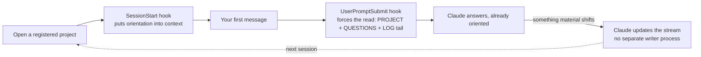

# Permanence

> Created by **Steven Loftus** (2026) — Licensed under [GPLv3](./LICENSE)

**Permanence is externalised working memory — for you and whichever AI you're using, so neither of you starts from zero, every session.**

You close the laptop, come back tomorrow, and your AI assistant remembers nothing — not the decision you made, not why you ruled out the other approach, not who's waiting on what. Running one project, that's a nuisance. Running several at once — client work, internal programmes, your own projects, each moving at a different pace — you forget the details too, especially if holding a dozen things in your head at once was never going to work in the first place. So you spend the first ten minutes of every session re-explaining the project to the AI, or you don't, and it quietly repeats a mistake you already fixed once — and even then, nothing hands the same picture back to *you* when you're the one who opens the laptop.

**Permanence is the fix**: it holds the state of your ongoing projects — what's happening, who's involved, what's decided, what's open — in plain markdown + git, so both you and the AI pick up exactly where you left off instead of rebuilding context every time. It's for any kind of ongoing project you run *with* an AI assistant, not just software — a client engagement, a programme you're managing, a piece of writing — anywhere you'd otherwise be the one holding all the state in your head.

**Without it** — you open a session on a project you touched last week:

> You explain it from scratch: what it's for, what's decided, who's waiting on what, the approach you already tried and ruled out. Ten minutes gone before any real work starts — and if you skip the explanation, the AI quietly repeats the mistake you already fixed once.

**With it** — you open the same session:

> Before Claude answers your first message, it has already read `PROJECT.md`, the open `QUESTIONS.md`, and the tail of `LOG.md`. It picks straight up where you left off — the decision, the person waiting on it, the dead end you already ruled out — without you saying a word about it.

This isn't a demo — it's the author's actual daily driver, running **14 concurrent project streams** for months, one of them carrying **11,000+ lines across nearly 500 dated entries**. This repo ships with **none of that** — just the machinery, the conventions, and a worked example in a far domain (home decorating/DIY), including a real `/perma-consolidate` report (`example/.consolidation/REPORT-example.md`) so you can see what the tidy pass actually produces before you ever run it yourself.

---

## Install it — about 10 minutes

**The lazy way: hand your AI this repo and one instruction.** Paste both lines into Claude Code (or any AI assistant with shell access):

> `https://github.com/lotusboy/permanence`
> *"Clone this to `~/permanence`, then read its README.md and QUICKSTART.md and set Permanence up for me."*

**The manual way — three commands:**

```bash
git clone https://github.com/lotusboy/permanence.git ~/permanence
cd ~/permanence && rm -rf .git && git init && git add -A && git commit -m "My Permanence"
~/permanence/runtime/install.sh
```

Three things worth saying plainly:

- **Throwing away `.git` and re-initialising is deliberate, not a mistake.** Your Permanence fills up with your own private notes about real projects and real people. It becomes *your* repo with *your* history — not a fork of this one, and not something you'd ever push back here.
- **This is local-only — nothing is backed up unless you make it happen.** `.git` here is yours alone; there's no remote, and `install.sh` doesn't set one up. `runtime/make-backup.sh` gives you an encrypted, round-trip-verified backup **on this machine**, ready to copy off — it isn't run automatically, and getting the result off this machine is the one step it can't do for you. If this machine is the only copy, losing the machine loses everything.
- **You can still pull future improvements after that.** `/perma-upgrade` reads the upstream URL from `runtime/.update-source`, a tracked file in the repo — it doesn't depend on the git remote you just removed.

Then follow **[QUICKSTART.md](./QUICKSTART.md)** for the rest — mainly registering your first project, which is one sentence spoken to Claude.

Nothing here phones home. It's plain markdown and local shell scripts. Two things reach the network, both of them yours: the nightly tidy, which runs your own Claude (scheduled by `install.sh`, but inert until you give it a token — see QUICKSTART §6), and `/perma-upgrade`, which fetches from the template repo when you ask it to.

> **Been handed a zip rather than the link?** Same thing — unzip it, move the folder to `~/permanence`, open it in your AI assistant and say *"read README.md and QUICKSTART.md, then set this Permanence up for me."*

---

## The shape

A **stream** is one ongoing concern — a project, an area of life — in its own folder, holding a few canonical files:
- `PROJECT.md` — current state (carries a `Last updated` date)
- `LOG.md` — chronological notes, **append-only** (newest first)
- `PEOPLE.md` — who's involved + how to work with them
- `QUESTIONS.md` — open questions (close with `[CLOSED YYYY-MM-DD: answer]`, don't delete)
- (`STRATEGY.md`, `README.md` as needed)

A folder is a stream exactly when it has a `PROJECT.md` — that's what the tooling discovers. (See `example/home/kitchen` for the full set; `example/home/bathroom` for a lighter one.)

**Turning a project into a stream — `/perma-register`.** Say *"register this project"* (point it at the README if there is one) and Claude creates the stream, seeds it from the README, and adds one row to `_meta/REGISTRY.md`. That's the whole setup — no manual file-wrangling. You don't even have to remember to do it: open a new, unregistered project and start doing real work, and Claude will notice and offer to register it — once per session, so a "no thanks" holds for that conversation rather than interrupting you repeatedly. No project folder yet, just an idea and a name (a desktop-app conversation with nothing to point at)? Say *"start a new project called kitchen renovation"* — Permanence picks and creates the real folder itself.

**A tech lead tracking a team's repos from one vantage point — `/perma-register-group`.** This is still one person's own Permanence — nobody else on the team needs to run it. Point it at several repos you have cloned locally, and each one's `/perma-shutdown` refreshes one shared plan-and-status folder in a coordinating repo, written for a reader who isn't in the work (a programme manager or director). It reads members via local `git log`, so it can't coordinate across different people's laptops — this is one owner's view across several repos, not a team collaboration tool. Run `/perma-register-group` to set one up: it adds the `_meta/GROUPS.md` rows and scaffolds the folder from `templates/programme-task-doc.md`. The report shape and RAG rules are **fixed across every group** (versioned `REPORT SPEC v1`) so several programmes read the same way side by side; roles, phases, and document names are yours to set. Do nothing and it stays off — `/perma-shutdown` skips the step silently while `GROUPS.md` only holds its shipped example rows.

## The four conventions (the real value)

1. **The people-rule.** Notes on people: observable behaviour + impact as *fact*; your read of *why* as a dated, provisional *inference* you revisit; conduct, never fixed character; written as if they'll read it. (A pre-commit guard scans staged markdown for phrasing that crosses this line and **stops the commit**, quoting the flagged line — heuristic, so false positives happen; `git commit --no-verify` is the sanctioned override.) See `example/home/kitchen/PEOPLE.md`.
2. **Append, don't rewrite.** LOGs grow; questions close with markers, not deletion. The history is the value.
3. **One-way flow.** Permanence reads your project context; project repos never reference Permanence. Keeps private notes out of shared/published code.
4. **Gentle, accurate register.** Blunt thinking is fine in your head; what gets *written down* is rendered kindly and precisely — same meaning, safer key.

## The loops



- **Write / read — how "automatic" actually works, on Claude Code.** No daemon watches your conversation; it's two hooks plus one instruction, every session (the diagram above shows this path):
  1. **SessionStart** (`session-start.sh`) fires when you open a registered project — resolves the stream from `_meta/REGISTRY.md` and puts orientation into context.
  2. **UserPromptSubmit** (`session-load.sh`) fires on your first message — this is the *reliable* trigger. A passive SessionStart note is easy for a model to skim past; this one forces the instruction onto the very message Claude is about to answer, so it actually reads `PROJECT.md` / `QUESTIONS.md` / the `LOG.md` tail before responding.
  3. **That's also where the write side comes from.** What Claude reads includes the standing rule itself — *update this stream whenever something material shifts, without being asked.* There's no separate writer process: the same model, in the same conversation, keeps the files current because it was told to and follows through, the same way it follows any other instruction you give it.

  Worth being honest about the limit: this is instruction-following, not a guarantee — nothing mechanically enforces it. `/perma-consolidate` exists partly as the safety net for exactly that gap, catching drift if an update ever gets missed.
- **No hooks available (desktop AI apps)?** There's no SessionStart/UserPromptSubmit to fire automatically, so the same two moments happen by asking instead: **`/perma-startup <name-or-path>`** does the SessionStart+UserPromptSubmit job manually — resolve the stream (by name or path, whichever you remember) and read it before answering — and **`/perma-shutdown`** does the write side, same as above. Which stream "material shifts" write to is whichever was resolved most recently in the conversation, until you switch. See [QUICKSTART.md](./QUICKSTART.md) §5 and [docs/TOOL-SUPPORT.md](./docs/TOOL-SUPPORT.md) for the concrete per-app detail.
- **Consolidate** (`/perma-consolidate` → `/perma-consolidate-review`) — a periodic tidy: catches stale PROJECTs, closes aged inferences, dedupes. See `example/.consolidation/REPORT-example.md`.
- **Orchestrate** (`/perma-orchestrate`) — finds ideas converging across streams you didn't connect. See `example/_meta/emergent.md`. (Only useful once you have a few streams — ignore it at first.)

## Why "Permanence"

This started life as **the brain** — the author's own daily-driver tool, in use (and shared with colleagues) for months before any of it was public. It was renamed to Permanence in 2026-08-29, after "object permanence" — the ADHD-community term for the exact failure mode this tool exists to fix: things, and people, ceasing to exist the moment they're out of sight or out of context. The author has ADHD; this tool started as the externalisation of a compensation he already needed for himself. The insight that made it worth building for anyone else: an AI assistant has the *identical* failure mode, once, every single session, by design — no memory of anything not currently in front of it. Give both of you a place outside your own head where state actually persists, and "out of sight, out of mind" stops being inevitable for either of you.

The GitHub repo itself passed briefly through `object-permanence` around the same rename — purely a repo-naming choice, live for only a few days, reverted once it turned out to solve a naming collision the wrong way. Neither the install folder nor the product name ever changed from **Permanence**; only the repo's own GitHub name moved, and moved back. If you're still on the old `~/brain` install, `runtime/migrate-from-brain.sh` handles that move directly.

Companion project: [`axis-engineering`](https://github.com/lotusboy/axis-engineering) — the reasoning methodology this tool is built on, from the same author, born from the same neurodivergent cognitive profile.

## Optional extras (opt-in — `install.sh` prints how to switch each on; skip until you want them)

- **Events** (`/perma-emit`) — when you've two projects open, one can flag something material to the *other's* Claude (a decision, a blocker), agent-to-agent. Emitting works out of the box; *receiving* is two machine-wide hooks you enable deliberately: a **UserPromptSubmit** hook surfaces waiting messages on the other session's next prompt, and a **Stop** hook catches a message that lands *mid-turn* — right as that session would go idle — and has it read them before stopping. Both are free (a local file read; they cost a turn only when there's actually a message) and share one cursor, so each message arrives once. Pub/sub: the sender never sees its own event. *(Truly-idle wake — with no user turn at all — needs an external nudge; see SPEC.)*
- **Shutdown nudge** — a weekday end-of-day reminder to run `/perma-shutdown`, so the habit survives past week one: `~/permanence/runtime/shutdown-nudge.sh --install 17:00` (`--uninstall` to stop).

These are deliberately off by default — the core (streams + the loops above) is the whole point; reach for them when you feel the specific need. (Programme groups, described above, need no toggle at all — they're just there, inert until you actually add a real row.)

## What's in here

| Path | What it is |
|---|---|
| `runtime/` | the machinery — `session-start.sh` (loads the right context per workspace), `session-load.sh` (the reliable trigger — forces the read on your first message), `generate-contents.sh`, `install.sh`, `nightly-consolidate.sh`, `schedule-task.sh` (cross-platform scheduling), `claude-md-block.md` + `agents-md-block.md`, and `commands/` (the `/perma-*` commands: help, brief, startup, shutdown, list, consolidate, consolidate-review, contents, orchestrate, register, register-group, upgrade). **Opt-in extras** (install prints how): cross-project **events** (`/perma-emit`), the **shutdown nudge**. |
| `.githooks/` | a **people-rule pre-commit guard** + a post-commit inventory refresh |
| `SPEC.md` | the system, harness-independently — data model, invariants, runtime contract |
| `docs/` | reference for one specific situation, read only when you're in it: [`UPGRADE.md`](./docs/UPGRADE.md) (the `/perma-upgrade` walkthrough) and [`TOOL-SUPPORT.md`](./docs/TOOL-SUPPORT.md) (which AI tools are automated vs. manual, including Claude Desktop) |
| `templates/` | blank skeletons for the canonical files |
| `example/` | a **fictional** populated Permanence (home decorating/DIY) showing the shape + each mechanism in action. **Delete `example/` once your own streams are going.** |
| `axis/` | archived [`axis-engineering`](https://github.com/lotusboy/axis-engineering)-methodology review runs — historical snapshots describing the codebase as it was on that date, not current docs |
| `_meta/REGISTRY.md` | maps each of your project folders → Permanence stream it should load (you fill this in) |

> **Why root vs. `docs/`?** Root holds what everyone needs on day one (`QUICKSTART.md`), what convention already puts there (`README`, `LICENSE`, `CHANGELOG`), and the one file everything else answers to (`SPEC.md` — every command's behavior traces back to its invariants, so it's foundational even though most people never open it day one). `docs/` is reference for one specific situation — you open it when you're actually upgrading, or actually on a different tool, not before.
>
> New here, or forgotten what's available? **`/perma-help`** lists every command and shows which background pieces are actually switched on for your machine.

## Staying current

The machinery improves over time. To pull the latest **without** disturbing your own streams or notes, run **`/perma-upgrade`** any time — `runtime/.update-source` is already pointed at the public template on a fresh clone, so there's no setup step unless you're on a private fork (in which case, point it at that instead). It shows you what's changing before anything happens, negotiates any file you've customized that the release also touched, and proposes (never silently applies) anything from `CHANGELOG.md` that might affect your own streams — see [docs/UPGRADE.md](./docs/UPGRADE.md) for the full walkthrough. Everything lands as a normal, revertable commit in your Permanence's own history.

## Get going

Install commands are at the [top of this page](#install-it--about-10-minutes); the walkthrough is **[QUICKSTART.md](./QUICKSTART.md)**.

> Fully automated on **Claude Code** (the `/perma-*` commands, the SessionStart hook); works with other AI tools too (Devin, Google Antigravity, Cursor, and anything reading the `AGENTS.md` standard), automated where the tool supports a global config file, manual otherwise — see [docs/TOOL-SUPPORT.md](./docs/TOOL-SUPPORT.md), which also covers **Claude Desktop's Code and Cowork tabs specifically** (including what IT/Ops needs to grant). Using something with no file/shell access at all, like a plain chat interface? The manual pointer in that doc still works for reading — but Permanence needs real command execution (`git`, `mkdir`), not just chat. `SPEC.md` separates the harness-independent contract from any binding. Built on the **axis-engineering** methodology (a separate, public companion — optional).

## License

Copyright (C) 2026 Steven Loftus. Licensed under the [GNU General Public License v3.0](./LICENSE) — free to use, modify, and distribute, including commercially; a distributed modified version must stay open under the same terms.
